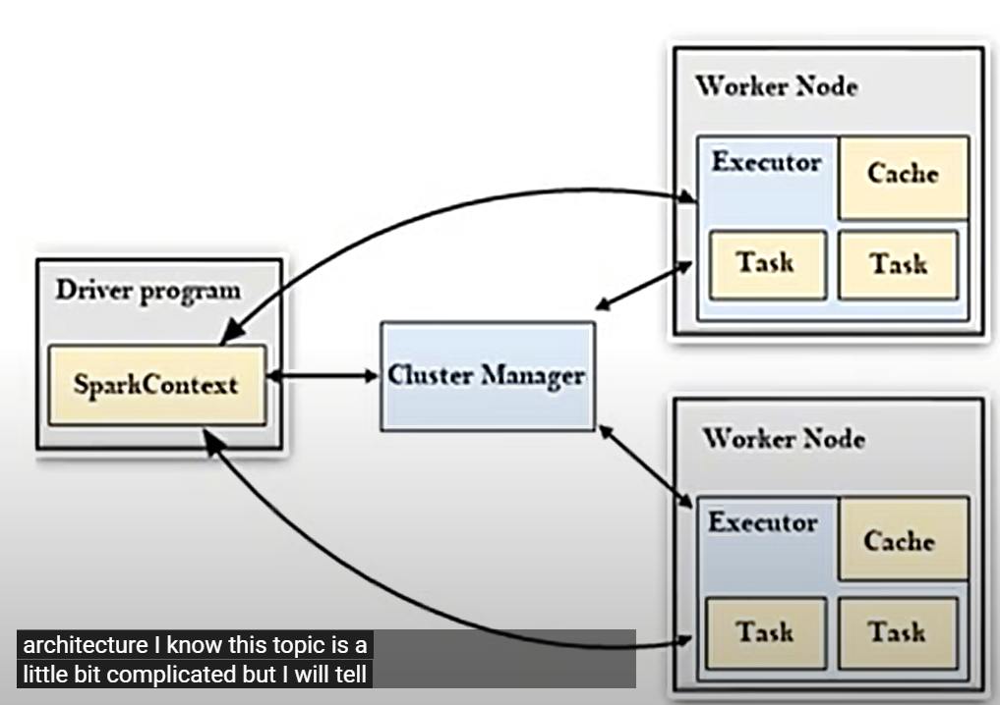

Earlier we used mounting if we need to load the data but now we use unity catalog.
Databricks is independent and can be used with all the clouds like GCP.

Every node is a machine and cluster is group of machines. 
Below is spark architecture. 
 

- Driver program breaks the data processing n small-small tasks and will give ingo what needs to happen.
Also tells how many nodes are required t execute the tasks.
- databricks manages 

